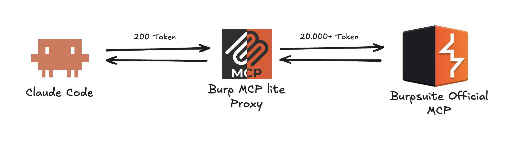

<a id="readme-top"></a>

<!-- PROJECT SHIELDS -->
[![MIT License][license-shield]][license-url]
[![Node.js][node-shield]][node-url]
[![TypeScript][typescript-shield]][typescript-url]
[![MCP][mcp-shield]][mcp-url]


<!-- PROJECT LOGO -->
<br />
<div align="center">
  <a href="https://github.com/0xdead4f/burp-mcp-lite">
    
  </a>

  <h3 align="center">burp-mcp-lite</h3>

  <p align="center">
    A token-efficient middleware for Burp Suite MCP Server.
    <br />
    <br />
    <a href="#usage">Usage</a>
    ·
    <a href="https://github.com/0xdead4f/burp-mcp-lite/issues">Report a bug</a>
    ·
    <a href="https://github.com/0xdead4f/burp-mcp-lite/issues">Request a feature</a>
  </p>
</div>


<!-- TABLE OF CONTENTS -->
<details>
  <summary>Table of Contents</summary>
  <ol>
    <li>
      <a href="#about-the-project">About The Project</a>
      <ul>
        <li><a href="#built-with">Built With</a></li>
      </ul>
    </li>
    <li>
      <a href="#getting-started">Getting Started</a>
      <ul>
        <li><a href="#prerequisites">Prerequisites</a></li>
        <li><a href="#installation">Installation</a></li>
        <li><a href="#verify">Verify</a></li>
      </ul>
    </li>
    <li>
      <a href="#usage">Usage</a>
      <ul>
        <li><a href="#tools">Tools</a></li>
        <li><a href="#body-slice-dsl">Body-slice DSL</a></li>
        <li><a href="#status-filter-syntax">Status filter syntax</a></li>
        <li><a href="#default-redaction">Default redaction</a></li>
        <li><a href="#cli-flags">CLI flags</a></li>
      </ul>
    </li>
    <li><a href="#roadmap">Roadmap</a></li>
    <li><a href="#contributing">Contributing</a></li>
    <li><a href="#license">License</a></li>
    <li><a href="#contact">Contact</a></li>
    <li><a href="#acknowledgments">Acknowledgments</a></li>
  </ol>
</details>


<!-- ABOUT THE PROJECT -->
## About The Project

The official Burp Suite MCP extension exposes **24 tools** and serializes the
full request plus full response on every history entry. A 20-row history
listing burns ~10,000 tokens before any work happens, and that's *before*
the model has decided which entry to look at.

`burp-mcp-lite` is a thin middleware that sits between your LLM client and
Burp's official MCP. It exposes **six** purpose-built tools, projects only
the columns you ask for, hides headers and cookies by default, redacts
auth-bearing values, and provides a `match` *predicate* primitive that
answers yes/no with a small evidence snippet instead of dumping the whole
body into your context.

#### Token usage upstream vs. lite

Numbers below are approximations for typical traffic (mid-size JSON APIs,
~1.5 KB request, ~2 KB response, common cookie/auth headers). Your mileage
will vary with actual response sizes, but the ratios are stable.

| Operation | Official Burp MCP | `burp-mcp-lite` | Reduction |
|---|---:|---:|---:|
| **Tool-schema cost** *(every turn, before any work)* | ~2,400 tok (24 tools) | ~500 tok (6 tools) | **~5×** |
| **List 20 history entries** | ~14,000 tok *(full req+resp per row)* | ~250 tok *(id, method, status, host, path, len)* | **~55×** |
| **View one request** *(headers + body)* | ~1,200 tok | ~350 tok *(headers off + redacted by default)* | **~3×** |
| **View one response** *(2 KB JSON body)* | ~1,500 tok | ~600 tok *(`auto` slices >4 KB; redacts Set-Cookie)* | **~2.5×** |
| **"Does this response contain `eyJ...`?"** | ~1,500 tok *(must read full body)* | ~30 tok *(`match` returns yes/no + 240-char snippet)* | **~50×** |
| **Inventory: distinct endpoints across 200 entries** | ~140,000 tok *(re-pull all)* | ~600 tok *(`endpoints` dedups server-side)* | **~230×** |
| **Headline workflow** *(list 20 → view 2 → match 5)* | ~22,000 tok | ~600 tok | **~35×** |

The cost driver isn't a single tool — it's that every history fetch upstream
returns full request + full response, and every turn pays the 24-tool schema
even when only one of those tools matters. The lite project trims both axes.

<p align="right">(<a href="#readme-top">back to top</a>)</p>


### Built With

* [![Node.js][node-shield]][node-url]
* [![TypeScript][typescript-shield]][typescript-url]
* [![MCP][mcp-shield]][mcp-url]
* [Zod](https://zod.dev/) — tool input schemas (validates + emits JSON Schema for the wire)
* [Commander](https://github.com/tj/commander.js) — CLI parsing
* [tsup](https://tsup.egoist.dev/) — single-file bundle with a `#!/usr/bin/env node` shebang
* [Vitest](https://vitest.dev/) — unit + e2e tests

<p align="right">(<a href="#readme-top">back to top</a>)</p>


<!-- GETTING STARTED -->
## Getting Started

### Prerequisites

* **Node.js ≥ 18.17** — `node -v` to check.
* **Burp Suite** with the official MCP extension enabled and listening on
  `http://127.0.0.1:9876/` (the default). Without Burp running, you can
  still smoke-test using the `--fixture` flag.

### Installation

The recommended path is **`npx`** — no global install, always picks up the
latest published version on demand:

```bash
claude mcp add burp -- npx -y burp-mcp-lite
```

Restart Claude Code, run `/mcp`, and `burp` should appear with six tools.

<details>
<summary>Alternative: global install</summary>

```bash
npm install -g burp-mcp-lite
claude mcp add burp -- burp-mcp-lite
```
</details>

<details>
<summary>Alternative: manual config (Claude Desktop, generic MCP clients)</summary>

Drop this into `~/Library/Application Support/Claude/claude_desktop_config.json`
on macOS (or the equivalent on your platform):

```json
{
  "mcpServers": {
    "burp": {
      "command": "npx",
      "args": ["-y", "burp-mcp-lite"]
    }
  }
}
```
</details>

<details>
<summary>Alternative: local checkout for development</summary>

```bash
git clone https://github.com/0xdead4f/burp-mcp-lite.git
cd burp-mcp-lite
npm install
npm run build
claude mcp add burp -- node $(pwd)/dist/cli.js
```

`npm test` runs the full suite (90 tests across unit, integration, and a
real-stdio e2e). `npm run dev -- --verbose` runs the server live without a
build step.
</details>

### Verify

```bash
# Live: Burp must be running with the official MCP extension enabled.
npx -y burp-mcp-lite --verbose

# Offline smoke test — no Burp needed.
npx -y burp-mcp-lite --fixture tests/fixtures/sample.json
```

<p align="right">(<a href="#readme-top">back to top</a>)</p>


<!-- USAGE -->
## Usage

### Tools

| Tool | Purpose |
|---|---|
| `list_history` | Browse + filter proxy history with field projection. Default columns: `id, method, status, host, path, len`. |
| `view_request` | View one request by id. Headers and cookies off by default. |
| `view_response` | View one response by id. `body="auto"` truncates >4 KB bodies to `head:20`. |
| `match` | Predicate query: does the entry match a regex? Returns `matched: true/false` + a small evidence snippet — never the full body. |
| `endpoints` | Deduplicated method+host+path inventory with hit counts. |
| `stats` | Aggregates: by method, status class, top hosts. |

### Body-slice DSL

Used by `view_request` and `view_response`:

| Spec | Result |
|---|---|
| `full` | Whole body. |
| `none` | Empty. |
| `head:N` | First N lines. |
| `tail:N` | Last N lines. |
| `/regex/` | Matching lines plus `context` lines on either side. |
| `auto` *(view_response default)* | `full` if body ≤ 4 KB, else `head:20` with a marker. |

Long matching lines are capped at ~240 chars **centered on the match** —
the predicate viewer never echoes a 50 KB minified-JSON line just because
it contained the needle.

### Status filter syntax

The `list_history` `status` argument accepts:

| Spec | Match |
|---|---|
| `200` | Exact. |
| `4xx` | Class. |
| `200-204` | Range. |
| `4xx-5xx` | Class range. |
| `200,4xx,500` | Comma-separated mix. |

### Default redaction

Values for these headers are replaced with `<redacted Nc>` (length stub) by
default — the model can see "auth is present" without paying for the bytes:

`Authorization`, `Proxy-Authorization`, `Cookie`, `Set-Cookie`, `X-Api-Key`,
`X-Auth-Token`, `X-Csrf-Token`, `X-Access-Token`.

Pass `redact=false` on `view_request` / `view_response` when you need the
raw bytes.

### CLI flags

Pass extra flags after `--`:

```bash
claude mcp add burp -- npx -y burp-mcp-lite --max-entries 500 --ttl 60
```

| Flag | Default | Purpose |
|---|---|---|
| `--url URL` | `http://127.0.0.1:9876/` | Burp MCP SSE URL. |
| `--page-size N` | `20` | Per-call page size from Burp. Keep low; large pages can close the SSE pipe mid-fetch on entries with very long Cookie headers. |
| `--max-entries N` | `5000` | Cap on history entries pulled per refresh. |
| `--ttl SEC` | `30` | Snapshot cache TTL before auto-refresh. |
| `--fixture FILE` | — | Read history from a JSON fixture instead of Burp (offline dev). |
| `-v, --verbose` | off | Log to stderr. |

<p align="right">(<a href="#readme-top">back to top</a>)</p>


<!-- ROADMAP -->
## Roadmap

- [x] Six-tool surface with field-projected listings
- [x] Default-headerless, default-redacted views
- [x] `match` predicate with bounded evidence (windowed snippets)
- [x] Per-entry timestamp (response `Date` header → `observedAt` fallback)
- [x] Anchor-probe incremental refresh (stable ids across refreshes)
- [x] Tolerant JSON salvage for upstream-truncated entries
- [ ] `endpoints` pagination (`limit` / `offset`) — currently unbounded
- [ ] `--redact-extra HEADER` CLI flag for project-specific secret headers
- [ ] Smarter scheme inference (currently hardcoded `https`; Burp drops scheme)
- [ ] WebSocket history support

See [open issues](https://github.com/0xdead4f/burp-mcp-lite/issues) for the
full list.

<p align="right">(<a href="#readme-top">back to top</a>)</p>


<!-- CONTRIBUTING -->
## Contributing

PRs welcome. The shape of a good contribution:

1. Fork → branch (`git checkout -b feat/short-name`)
2. Add a test that pins the new behavior — `npm test` must stay green
3. `npx tsc --noEmit` must stay clean
4. `npm run build` must produce a working `dist/cli.js`
5. Open a PR

Design invariants worth knowing before you change anything:

* **Stable ids.** `view_request(id=42)` must return the same entry across
  refreshes within a session. Don't break the anchor-probe in `snapshot.ts`.
* **Default-quiet.** Headers off, cookies off, redact on. New tools follow
  the same posture.
* **Tool descriptions are tokens too.** Every word in a description is paid
  for on every turn. Keep them tight.
* **Predicates stay predicates.** `match` returns matched + bounded evidence.
  If a "snippet" can balloon to the full body, that's a bug.

<p align="right">(<a href="#readme-top">back to top</a>)</p>


<!-- LICENSE -->
## License

Distributed under the MIT License. See [`LICENSE`](LICENSE) for details.

<p align="right">(<a href="#readme-top">back to top</a>)</p>


<!-- CONTACT -->
## Contact

0xdead4f — [@0xdead4f](https://github.com/0xdead4f) · 0xdead4f@gmail.com

Project link: [https://github.com/0xdead4f/burp-mcp-lite](https://github.com/0xdead4f/burp-mcp-lite)

<p align="right">(<a href="#readme-top">back to top</a>)</p>


<!-- ACKNOWLEDGMENTS -->
## Acknowledgments

* [PortSwigger's official Burp MCP extension](https://github.com/PortSwigger/mcp-server) — the upstream this project sits behind.
* [Anthropic's Model Context Protocol](https://modelcontextprotocol.io/) and the [TypeScript SDK](https://github.com/modelcontextprotocol/typescript-sdk).
* README structure inspired by [Best-README-Template](https://github.com/othneildrew/Best-README-Template).

<p align="right">(<a href="#readme-top">back to top</a>)</p>


<!-- MARKDOWN LINKS & IMAGES -->
[license-shield]: https://img.shields.io/badge/license-MIT-green.svg
[license-url]: https://github.com/0xdead4f/burp-mcp-lite/blob/main/LICENSE
[node-shield]: https://img.shields.io/badge/Node.js-%E2%89%A518.17-43853d?logo=node.js&logoColor=white
[node-url]: https://nodejs.org/
[typescript-shield]: https://img.shields.io/badge/TypeScript-5.x-3178c6?logo=typescript&logoColor=white
[typescript-url]: https://www.typescriptlang.org/
[mcp-shield]: https://img.shields.io/badge/MCP-Server-orange
[mcp-url]: https://modelcontextprotocol.io/
